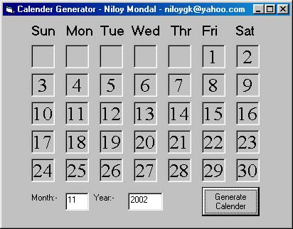



## \[Calender Generator\]

### Description

This program generates the calender of a given month and year, knowing the fact that 1st January 1900 was Monday. The code is simple and well commented.
 
### More Info
 

             |
---                |---
**Submitted On**   |2002-11-01 19:32:24
**By**             |[Niloy Mondal](https://github.com/Planet-Source-Code/PSCIndex/blob/master/ByAuthor/niloy-mondal.md)
**Level**          |Beginner
**User Rating**    |4.4 (48 globes from 11 users)
**Compatibility**  |VB 6\.0
**Category**       |[Coding Standards](https://github.com/Planet-Source-Code/PSCIndex/blob/master/ByCategory/coding-standards__1-43.md)
**World**          |[Visual Basic](https://github.com/Planet-Source-Code/PSCIndex/blob/master/ByWorld/visual-basic.md)
**Archive File**   |[^Calender\_1490201112002\.zip](https://github.com/Planet-Source-Code/niloy-mondal-calender-generator__1-40317/archive/master.zip)

